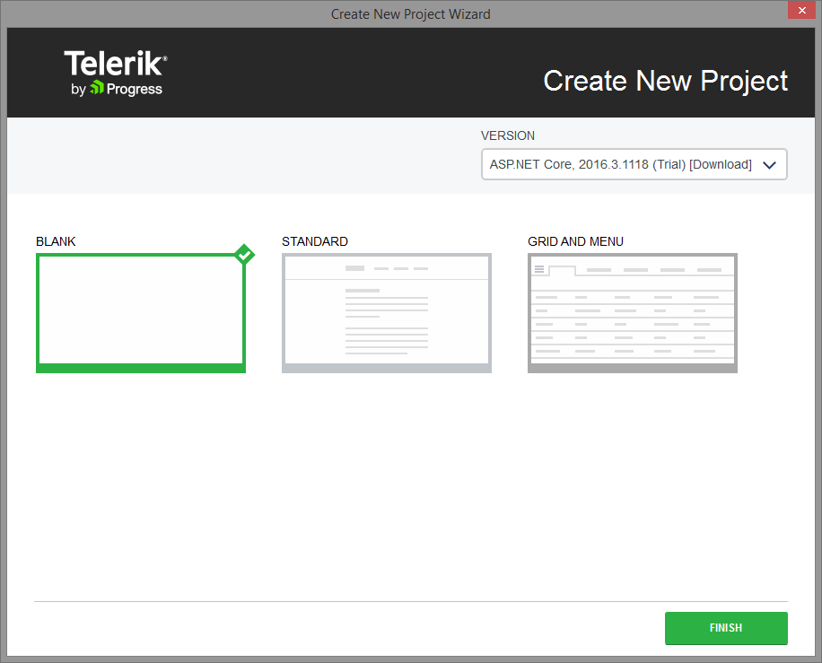

# Creating Projects

This article demonstrates how to create a new Telerik UI for ASP.NET Core application.

## Getting Started

### The Basics

You can create new Telerik UI for ASP.NET Core applications by using the **Create New Project Wizard**.

To start the **Create New Project Wizard**, follow either of the approaches below.

**Approach 1**

1. Go to the Telerik menu.
2. Click **Telerik** > **UI for ASP.NET Core** > **Create New Telerik Project**.

**Approach 2**

1. Click **File** > **New** > **Project**.
2. Navigate to the Telerik ASP.NET Core MVC project templates under **Telerik** > **Web**.

For convenience, the same project templates are located under the **Visual C#** > **Web** and **Visual C#** > **.NET Core** nodes.

The wizard detects all installed versions of Telerik UI for ASP.NET Core and lists them in the **Version** combobox. This enables you to select a version you want to apply to your project.

**Figure 1. New Project Wizard**

### Project Settings

You can modify the project settings by configuring the options on the **Create New Project** page:

* **Project type**&mdash;Choose the desired project type: **Empty**, **Standard**, **Grid and Menu**.
* **Version**&mdash;Choose the version of Telerik UI for ASP.NET Core you want to use.

### Creating New ASP.NET Core Applications

After configuring the project settings, click **Finish** to start creating the new ASP.NET Core application.

As a result, the wizard:

* Creates a new ASP.NET Core application.
* Copies all Kendo UI scripts.
* Copies all Kendo UI content files.
* Copies all Kendo UI editor templates.
* Adds a package reference to the `Telerik.UI.for.AspNet.Core` NuGet package.

## See Also

* [Visual Studio Integration Overview]()
* [Downloading New Versions]()
